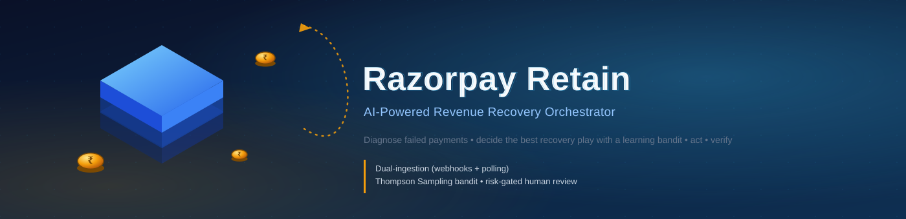
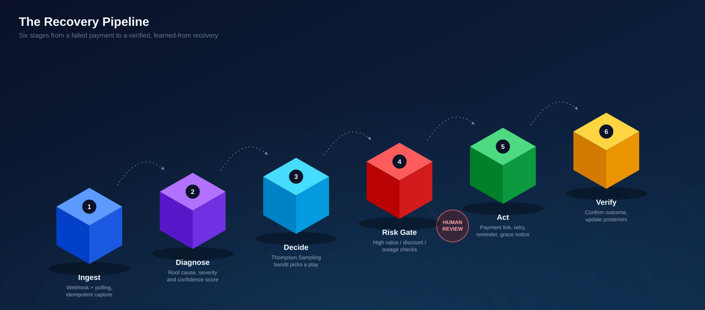
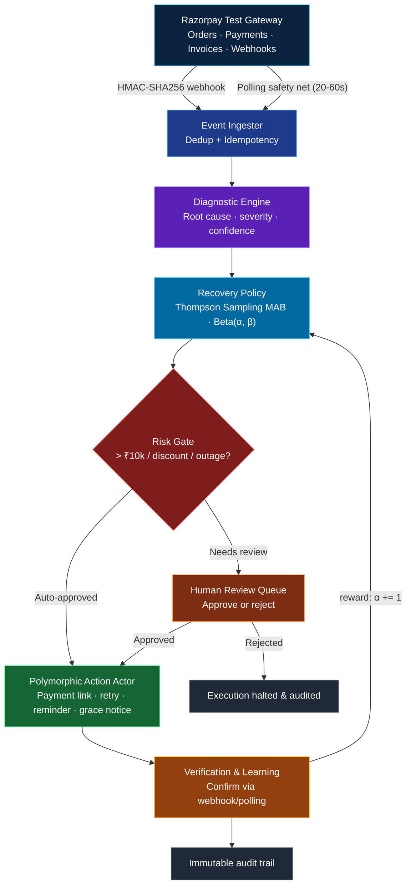

<p align="center">
  
</p>

<p align="center">
  <a href="https://fastapi.tiangolo.com"></a>
  <a href="https://react.dev"></a>
  <a href="https://vitejs.dev"></a>
  <a href="https://razorpay.com"></a>
  <a href="https://www.python.org"></a>
  <a href="https://www.sqlalchemy.org"></a>
  <a href="https://www.docker.com"></a>
  
</p>

<p align="center"><i>Diagnose failed payments, choose the best recovery play with a learning bandit, act, and verify — with zero data loss.</i></p>

<br/>

## 📚 Table of Contents

- [Executive Summary](#-executive-summary)
- [The Recovery Pipeline](#-the-recovery-pipeline)
- [End-to-End System Architecture](#-end-to-end-system-architecture)
- [Key Architectural Pillars](#-key-architectural-pillars)
- [Codebase & Directory Structure](#-codebase--directory-structure)
- [Quick Start & Installation](#-quick-start--installation)
- [Public Webhook Tunnel Setup](#-public-webhook-tunnel-setup-ngrok)
- [Test Cards Reference](#-documented-razorpay-test-cards-reference)
- [API Reference](#-api-reference)
- [Testing & Verification](#-testing--verification)
- [Security & Reliability](#-security--reliability-features)
- [License](#-license)

---

## 📌 Executive Summary

**Razorpay Retain** is an enterprise-grade, autonomous revenue recovery orchestrator designed to intercept, diagnose, and recover at-risk revenue across modern payment lifecycles. It tackles revenue leakages arising from:

- **Payment Failures** — insufficient funds, 3D Secure / OTP timeouts, network glitches, card issuer declines, and UPI collect rejections
- **Checkout Cart Drop-offs** — incomplete checkout sessions, abandoned carts, and client-side modal dismissals
- **B2B Overdue Invoices** — expired payment links, delayed commercial invoices, and unpaid receivable notices
- **Recurring Subscription Mandates** — halted auto-debits, recurring charge failures, and mandate lapses

By fusing a **Polymorphic Diagnostic Engine**, **Thompson Sampling Multi-Armed Bandit** (reinforcement learning), a **Risk-Gated Human-in-the-Loop (HITL) Review Queue**, and a **Dual-Ingestion Pipeline** (webhooks + polling safety net), Razorpay Retain provides an automated, adaptive, and explainable recovery workflow.

---

## 🧊 The Recovery Pipeline

<p align="center">
  
</p>

Every incident — a failed charge, an abandoned cart, an overdue invoice, a halted mandate — flows through the same six stages. High-value or discount-bearing actions detour through a human reviewer before anything is executed; everything else runs end to end automatically.

---

## 🏛️ End-to-End System Architecture

For the full wiring (including the dual-ingestion fan-in and the bandit reward loop), here's the detailed flow:



<details>
<summary>Prefer plain text? Click for the ASCII version</summary>

```
                                  ┌────────────────────────┐
                                  │ Razorpay Test Gateway  │
                                  │ (Orders, Payments,     │
                                  │  Invoices, Webhooks)   │
                                  └──────────┬─────────────┘
                                             │
                       ┌─────────────────────┴─────────────────────┐
                       │                                           │
         1a. Real-Time Webhook (HMAC-SHA256)         1b. Polling Safety Net Worker
         (POST /api/webhooks/razorpay)               (Background Sync every 20-60s)
                       │                                           │
                       └─────────────────────┬─────────────────────┘
                                             │
                                             ▼
                               ┌───────────────────────────┐
                               │ 2. EVENT INGESTER         │
                               │  - Deduplication          │
                               │  - Idempotency Guarantee │
                               │  - Ingest RevenueEvent    │
                               └─────────────┬─────────────┘
                                             │
                                             ▼
                               ┌───────────────────────────┐
                               │ 3. DIAGNOSTIC ENGINE      │
                               │  - Root Cause Analysis    │
                               │  - Confidence & Severity  │
                               │  - Systemic Outage Check  │
                               └─────────────┬─────────────┘
                                             │
                                             ▼
                               ┌───────────────────────────┐
                               │ 4. RECOVERY POLICY        │
                               │  - Thompson Sampling MAB  │
                               │  - Beta(α, β) Posteriors  │
                               │  - Action Selection       │
                               └─────────────┬─────────────┘
                                             │
                                             ▼
                               ┌───────────────────────────┐
                               │ 5. VERIFIER & RISK GATE   │
                               │  - High-Value (> ₹10k)    │
                               │  - Concession / Discount  │
                               │  - Systemic Gateway Outage│
                               └───────┬───────────┬───────┘
                                       │           │
                     Requires Review   │           │ Auto-Approved
                     (review: pending) │           │ (review: not_required)
                                       │           │
                                       ▼           │
                        ┌──────────────────────┐   │
                        │ 6. HUMAN REVIEW      │   │
                        │    QUEUE             │   │
                        │ - Operator Approves  │───┘
                        │ - Operator Rejects   │──────► [Execution Halted & Audited]
                        └──────────────────────┘
                                       │
                                       ▼
                        ┌──────────────────────────────┐
                        │ 7. POLYMORPHIC ACTION ACTOR  │
                        │ - Real Razorpay Payment Link │
                        │ - Alternate Payment Rails    │
                        │ - Cart Revival / Reminders   │
                        │ - Invoice Grace Notices      │
                        │ - Automatic Retry Triggers   │
                        └──────────────┬───────────────┘
                                       │
                                       ▼
                        ┌──────────────────────────────┐
                        │ 8. VERIFICATION & LEARNING   │
                        │ - Webhook / Polling Confirm  │
                        │ - Status: verified_success   │
                        │ - Reward Update: α ◄- α + 1  │
                        │ - Full Audit Trail Recorded  │
                        └──────────────────────────────┘
```

</details>

---

## 💡 Key Architectural Pillars

### 1. Dual-Ingestion Resilience (Zero Dropouts)
- **Primary Channel** — real-time Razorpay Webhook receiver with strict HMAC-SHA256 signature verification
- **Fallback Channel** — Polling Safety Net background worker querying Razorpay REST APIs for pending orders, failed transactions, and expired invoices using `razorpay_object_id` for strict idempotency
- **Resilience Guarantee** — if an ngrok tunnel drops during a live demo or network-partitioned environment, the Polling Safety Net automatically synchronizes and processes all missed events

### 2. Polymorphic Diagnostic Engine
Analyzes raw Razorpay error parameters (`error_code`, `error_description`, `error_source`, `error_step`, `error_reason`) to determine:
- **Root Cause Category** — `insufficient_funds`, `auth_failure` (OTP/3DS), `gateway_down`, `customer_cancelled`, `cart_abandonment`, `invoice_overdue`, or `subscription_halted`
- **Severity Score (1–5)** & **Confidence Metric (0.0–1.0)**
- **Systemic Outage Detection** — identifies bank/network gateway downtime affecting broad traffic

### 3. Bayesian Multi-Armed Bandit (Thompson Sampling)
- Maintains continuous probability distributions θₖ ∼ Beta(αₖ, βₖ) for each recovery strategy per event type
- Balances **exploitation** (deploying historically high-converting recovery actions) and **exploration** (testing underutilized actions)
- Dynamically updates posterior distributions (α ← α + 1 on verified settlement, β ← β + 1 on verified expiry/failure), giving mathematical explainability for every recommendation

### 4. Risk-Gated Human-in-the-Loop (HITL) Guardrails
Automated execution is safely intercepted and routed to the **Review Queue** (`review_status = 'pending'`) if:
1. **High Transaction Value** — amount exceeds ₹10,000.00 (1,000,000 paise)
2. **Financial Concessions** — strategy involves commercial margin reduction (discounts, fee waivers)
3. **Systemic Gateway Alerts** — gateway downtime or widespread outages requiring manual intervention

---

## 🗂️ Codebase & Directory Structure

<details>
<summary><b>Click to expand the full directory tree</b></summary>

```
Razorpay project/
├── backend/
│   ├── app/
│   │   ├── middleware/              # Security headers, rate limiting, and CORS
│   │   ├── routers/                 # FastAPI REST Endpoints
│   │   │   ├── audit.py             # Audit trail & explainability routes
│   │   │   ├── checkout.py          # Interactive checkout, payment links, invoices
│   │   │   ├── dashboard.py         # Recovery KPI aggregations & analytics
│   │   │   ├── events.py            # Revenue event inspection & filtering
│   │   │   ├── health.py            # Healthcheck & dependency probes
│   │   │   ├── polling.py           # Polling fallback controls & intervals
│   │   │   ├── recovery.py          # Policy stats, bandit posteriors, action triggering
│   │   │   ├── review.py            # HITL review queue approval / rejection
│   │   │   └── webhooks.py          # Razorpay HMAC-verified webhook ingestion
│   │   ├── services/                # Core Business Logic Engines
│   │   │   ├── actor.py             # Polymorphic action dispatch & execution
│   │   │   ├── audit_logger.py      # Immutable audit trail ledger writer
│   │   │   ├── diagnosis_engine.py  # Root cause & severity polymorphic classifier
│   │   │   ├── event_ingester.py    # Idempotent event ingestion & orchestration
│   │   │   ├── recovery_policy.py   # Thompson Sampling bandit policy engine
│   │   │   └── verifier.py          # Verification & bandit reward updater
│   │   ├── workers/                 # Background Asynchronous Workers
│   │   │   ├── abandonment_detector.py # Inactive cart dropoff detector
│   │   │   └── polling_fallback.py  # Background safety net sync worker
│   │   ├── config.py                # Pydantic Settings & environment validation
│   │   ├── database.py              # SQLAlchemy Async Engine, SessionFactory & Base
│   │   ├── models.py                # Relational ORM models (RevenueEvent, Diagnosis, etc.)
│   │   ├── razorpay_client.py       # Official Razorpay SDK integration wrapper
│   │   ├── schemas.py               # Pydantic schemas & response models
│   │   └── main.py                  # FastAPI application entry point & lifespan
│   ├── tests/                       # Pytest Test Suite
│   ├── Dockerfile                   # Production multi-stage Python container
│   ├── requirements.txt             # Python dependencies
│   └── .env.example                 # Backend environment variable template
│
├── frontend/
│   ├── src/
│   │   ├── api/                     # Axios API clients & endpoint bindings
│   │   ├── components/              # Reusable UI components (Layout, Badges, Metrics)
│   │   ├── context/                 # React Context (ThemeContext, NotificationContext)
│   │   ├── pages/                   # Main Page Views
│   │   │   ├── Dashboard.jsx        # KPI metrics, recovery graphs & live feeds
│   │   │   ├── Events.jsx           # Filterable incident list & diagnostic details
│   │   │   ├── ReviewQueue.jsx      # HITL approval / rejection interface
│   │   │   ├── Recovery.jsx         # Bandit posteriors & strategy performance
│   │   │   ├── Audit.jsx            # Chronological audit ledger & explainability
│   │   │   └── LiveTerminal.jsx     # Live Razorpay checkout, links & scenario driver
│   │   ├── App.jsx                  # React Router definitions
│   │   ├── main.jsx                 # React root DOM mount
│   │   └── index.css                # Tailwind CSS / custom design tokens
│   ├── nginx.conf                   # Nginx reverse proxy configuration for production
│   ├── Dockerfile                   # Multi-stage Vite build + Nginx production container
│   └── package.json                 # Frontend dependencies & scripts
│
├── docker-compose.yml               # Multi-container orchestration specification
├── .env.production.example          # Full-stack production environment template
└── README.md                        # Complete project documentation
```

</details>

---

## ⚡ Quick Start & Installation

### Prerequisites
- **Python** 3.11 or higher
- **Node.js** 18 or higher (with `npm`)
- **Razorpay Account** — free Razorpay Test Mode API Key & Secret ([dashboard.razorpay.com](https://dashboard.razorpay.com/app/keys))
- **ngrok** (optional, for live webhooks) — [ngrok.com](https://ngrok.com)

<details open>
<summary><b>Option A — Local Development Setup</b></summary>

**1. Configure the backend environment**
```bash
cd backend
cp .env.example .env
```
Edit `backend/.env`:
```env
ENVIRONMENT=development
DATABASE_URL=sqlite+aiosqlite:///./revenue_recovery.db
RAZORPAY_KEY_ID=rzp_test_YOUR_KEY_HERE
RAZORPAY_KEY_SECRET=YOUR_SECRET_HERE
RAZORPAY_WEBHOOK_SECRET=your_webhook_secret_here
PUBLIC_WEBHOOK_URL=http://localhost:8000
POLLING_INTERVAL_SECONDS=20
```

**2. Install dependencies & start the backend**
```bash
# In backend directory:
python -m venv venv
# Windows:
venv\Scripts\activate
# Linux/macOS:
source venv/bin/activate

pip install -r requirements.txt
python -m uvicorn app.main:app --host 0.0.0.0 --port 8000 --reload
```
- API Docs → [http://localhost:8000/docs](http://localhost:8000/docs)
- Health Check → [http://localhost:8000/health](http://localhost:8000/health)

**3. Install dependencies & start the frontend**
```bash
cd ../frontend
npm install
npm run dev
```
- Web App → [http://localhost:5173](http://localhost:5173)

</details>

<details>
<summary><b>Option B — Docker Compose (one-click launch)</b></summary>

```bash
# In root directory:
cp .env.production.example .env

# Start all containers in background
docker-compose up --build -d
```
- Frontend UI → [http://localhost](http://localhost)
- Backend API → [http://localhost:8000](http://localhost:8000)

</details>

---

## 🌐 Public Webhook Tunnel Setup (ngrok)

To receive real-time webhooks from the Razorpay Sandbox:

**1. Launch an ngrok tunnel**
```bash
ngrok http 8000
```

**2. Update `backend/.env`**
```env
PUBLIC_WEBHOOK_URL=https://abcdef123.ngrok-free.app
RAZORPAY_WEBHOOK_SECRET=my_secure_secret_123
```

**3. Configure the Razorpay Dashboard webhook**

In [Razorpay Test Dashboard](https://dashboard.razorpay.com/) → **Settings** → **Webhooks**:

| Field | Value |
|---|---|
| Webhook URL | `https://<your-ngrok-subdomain>.ngrok-free.app/api/webhooks/razorpay` |
| Secret | `my_secure_secret_123` |
| Subscribed Events | `payment.failed` · `payment.captured` · `order.paid` · `invoice.expired` · `subscription.charged.failed` · `subscription.halted` |

---

## 🃏 Documented Razorpay Test Cards Reference

Use these documented test credentials in the **Live Checkout Terminal** (`/terminal`) to trigger authentic gateway failure modes:

| Test Scenario | Card Number / Details | Expiry / CVV | Expected Gateway Response |
|---|---|---|---|
| **Insufficient Funds** | `4384 7968 2770 3274` (Visa) | Any Future / `111` | `BAD_REQUEST_ERROR` / `insufficient_funds` |
| **Issuer Decline** | `5312 6865 5677 9641` (Mastercard) | Any Future / `111` | `GATEWAY_ERROR` / `issuer_decline` |
| **3DS / OTP Auth Failure** | Standard Test Card | Enter Invalid OTP | `BAD_REQUEST_ERROR` / `invalid_otp` |
| **Gateway Timeout / Outage** | NetBanking Test Modal | Close / Timeout | `GATEWAY_ERROR` / `gateway_down` |
| **UPI Collect Decline** | UPI ID: `failure@razorpay` | N/A | `BAD_REQUEST_ERROR` / `customer_cancelled` |

---

## 🔌 API Reference

<details>
<summary><b>🛒 Checkout & Ingestion</b></summary>

| Endpoint | Description |
|---|---|
| `GET /api/checkout/config` | Returns public Razorpay key ID, gateway connection status, and active webhook configuration |
| `POST /api/checkout/create-order` | Creates a real Order on the Razorpay Test API for Standard Checkout |
| `POST /api/checkout/create-payment-link` | Generates a payable Razorpay Payment Link (`short_url`) |
| `POST /api/checkout/create-invoice` | Generates a formal B2B invoice on Razorpay |
| `POST /api/checkout/notify-failure` | Client-side interceptor for immediate payment modal failures |
| `POST /api/checkout/sync-now` | Triggers immediate synchronization via the Polling Safety Net |

</details>

<details>
<summary><b>📥 Webhooks</b></summary>

| Endpoint | Description |
|---|---|
| `POST /api/webhooks/razorpay` | HMAC SHA256 verified ingestion endpoint for Razorpay webhook events |

</details>

<details>
<summary><b>🛡️ Human-in-the-Loop (HITL) Review Queue</b></summary>

| Endpoint | Description |
|---|---|
| `GET /api/review-queue` | Fetches pending review items with full diagnostic context and bandit recommendations |
| `GET /api/review-queue/count` | Returns count of pending reviews for live sidebar badges |
| `POST /api/review/{id}/approve` | Approves a pending recovery action, logging operator identity and triggering execution |
| `POST /api/review/{id}/reject` | Rejects a pending recovery action with a mandatory audit reason |

</details>

<details>
<summary><b>📊 Dashboard, Policy & Audit</b></summary>

| Endpoint | Description |
|---|---|
| `GET /api/dashboard/summary` | High-level recovery metrics (total at risk, recovered amount, recovery rate, active incidents) |
| `GET /api/events` | Paginated, filterable incident history with root causes and severity scores |
| `GET /api/recovery/policy-stats` | Beta distribution posteriors (α, β, win rates, attempt counts) for all recovery strategies |
| `GET /api/audit/trail` | Immutable chronological audit logs with plain-language explainability dossiers |

</details>

---

## 🧪 Testing & Verification

Run the automated test suite with `pytest`:

```bash
cd backend
# Run all unit and integration tests
pytest

# Run with verbose output
pytest -v

# Run specific test suites
pytest tests/test_health_and_security.py
pytest tests/test_recovery_and_bandit.py
pytest tests/test_review_queue.py
pytest tests/test_webhooks_and_ingestion.py
```

---

## 🔒 Security & Reliability Features

- **HMAC SHA256 Signature Verification** — eliminates spoofed webhook submissions
- **Idempotency Guarantees** — enforces unique database constraints on `razorpay_object_id` to prevent duplicate billing or actions
- **Security Headers & Rate Limiting** — built-in security middleware configured for production hardening
- **Non-Destructive Database Fallbacks** — safe fallback mechanisms for test sandbox environments

---

## 📜 License

This project is licensed under the **MIT License**.

<p align="center">
  <sub>Built for the Razorpay ecosystem · Test Mode only · No production payment credentials required</sub>
</p>
